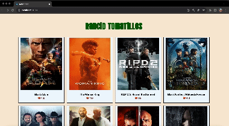

# Rancid Tomatillos

## Abstract:

This application allows the user to view a list of movies provided by the server along with their rating. When the movie is clicked the user can see more information about that particular movie. The app was designed to be responsive on computer screens mobile devices and tablets

## Application link:

[Rancid Tomatillos](https://github.com/ben-rosner-williamsburg/rancid-tomatillos)

## Instructions:

1. Change into the directory you want the app to be in

2. Run `git@github.com:ben-rosner-williamsburg/rancid-tomatillos.git`

3. Run `cd rancid-tomatillos`

4. Run `npm install`

5. Run `npm start` and it should automatically open the application in your browser

## Preview of App

## Context:

This is a paired project for the front end engineering program at the [Turing School of Software and Design](https://www.linkedin.com/school/turingschool/mycompany/)

## Contributors:

[Zen McMillan](https://www.linkedin.com/in/zen-mcmillan/) 

[Ben Rosner](https://www.linkedin.com/in/benrosner/)

## Challenges:

Ben - Implementing responsive design and thorougly testing using Cypress was a challenge for me. Also dividing the work equally was a challenge

Zen - This was my first time working with React so understanding how React works was challenging since it was all so new to me

## Wins 

Ben - Figuring out how to manipulate props and states as well as understanding React and React Router was a win for me. Figuring out how to work through different time zones although not tecnical was also a win for me

Zen - Understanding how to manipulate props and states was a win for me as well as understanding how to conduct end to end testing with Cypress

